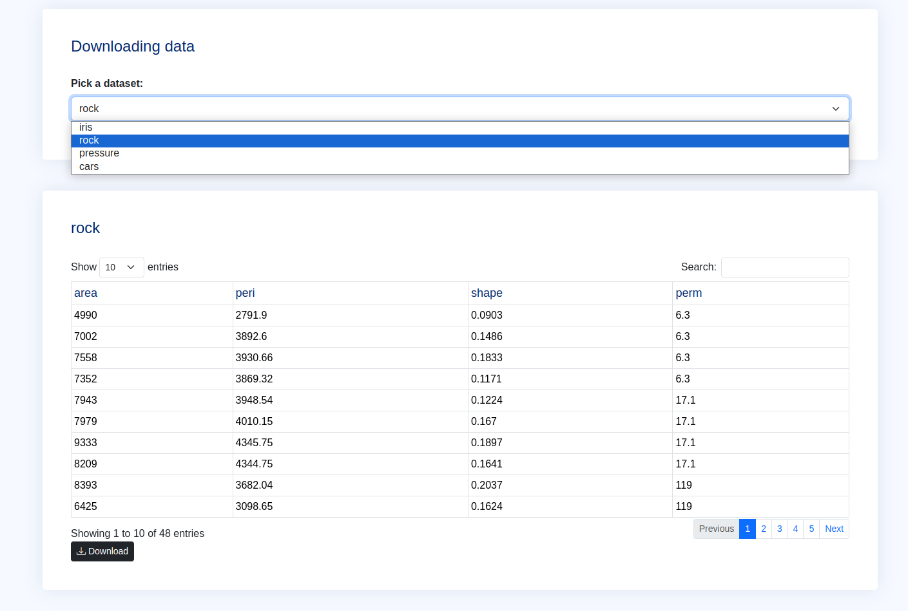
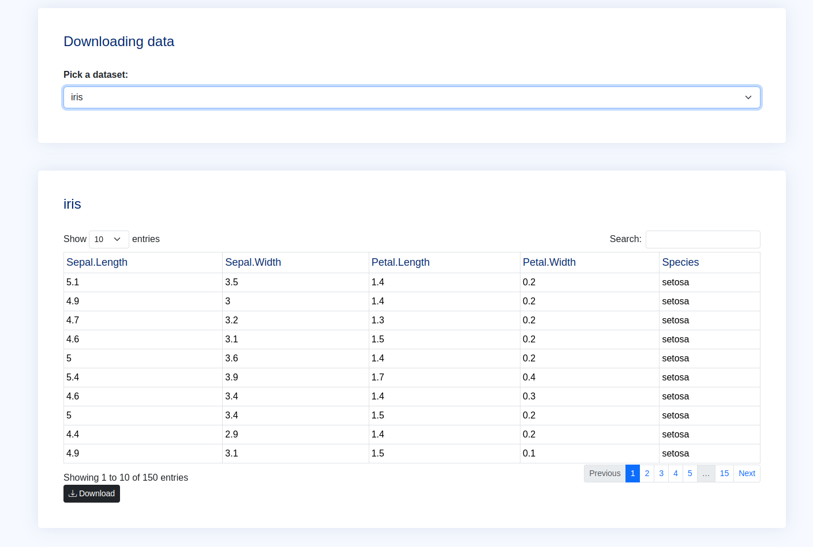
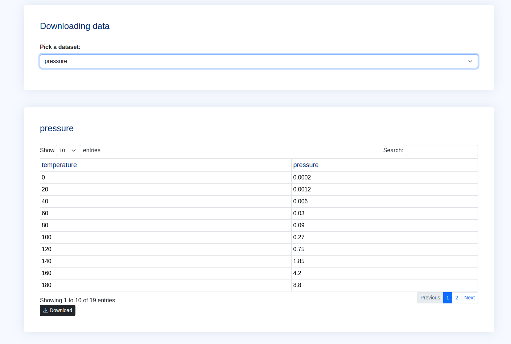

# File download

A simple app where the user can select, view & download a dataset.

# Exhibits

- rock



- iris



- pressure



# Installation

1. Clone this repo and `cd` into the `file-download/` directory.
   ```bash
   git clone git@github.com:kennedymwavu/ambiorix-htmx.git
   cd ambiorix-htmx/file-download/
   ```
1. Add an env file (`.Renviron`) at the root dir of the project with the following content.

   ```bash
    HOST = 127.0.0.1
    PORT = 8000
    RENV_CONFIG_SANDBOX_ENABLED = FALSE
   ```

   You can change the values of the variables to suit your environment.

1. Fire up R and install the dependencies.

   ```r
   renv::restore()
   ```

# Start app

`index.R` is the entry point of the app. Run the following command to start the app.

```bash
Rscript index.R
```
