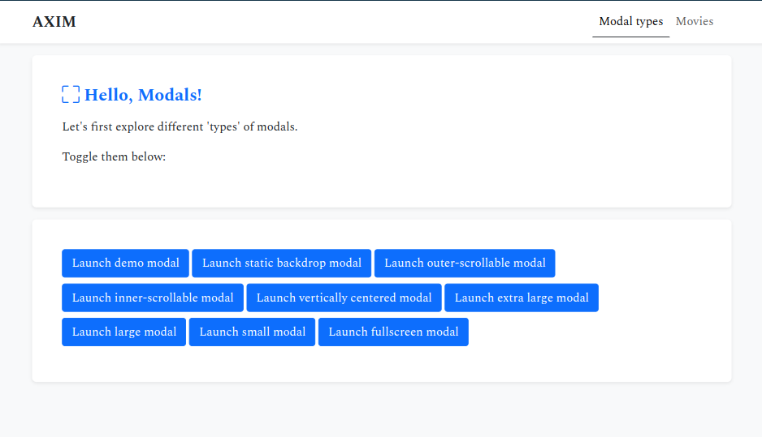
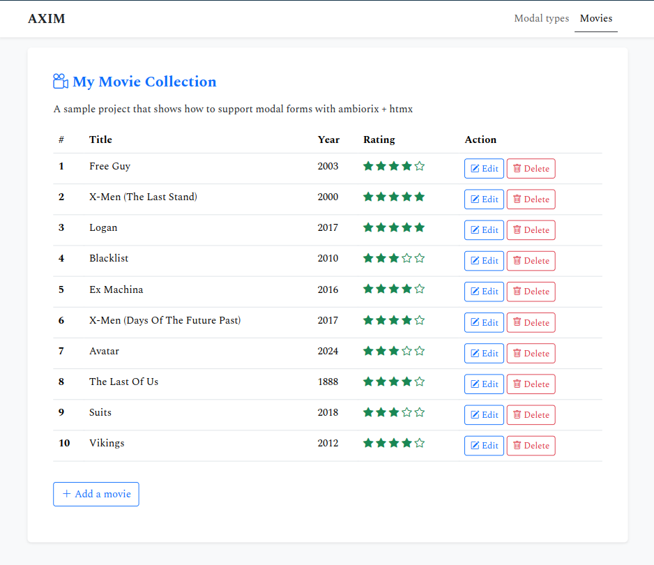
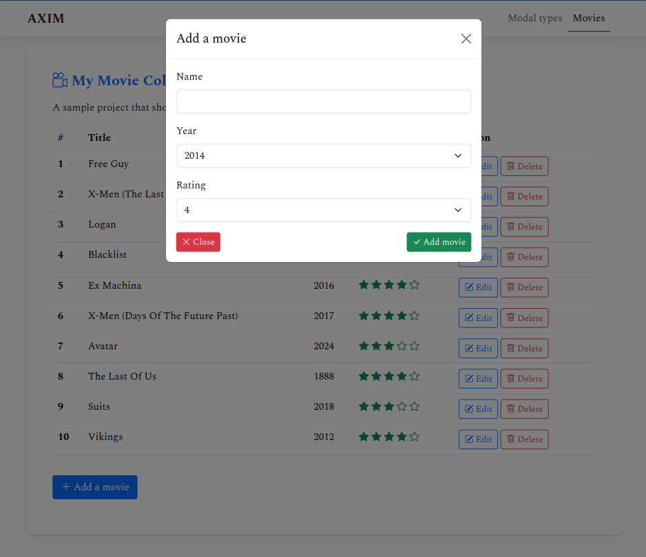
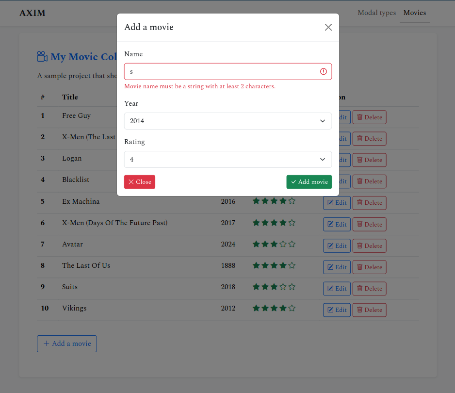
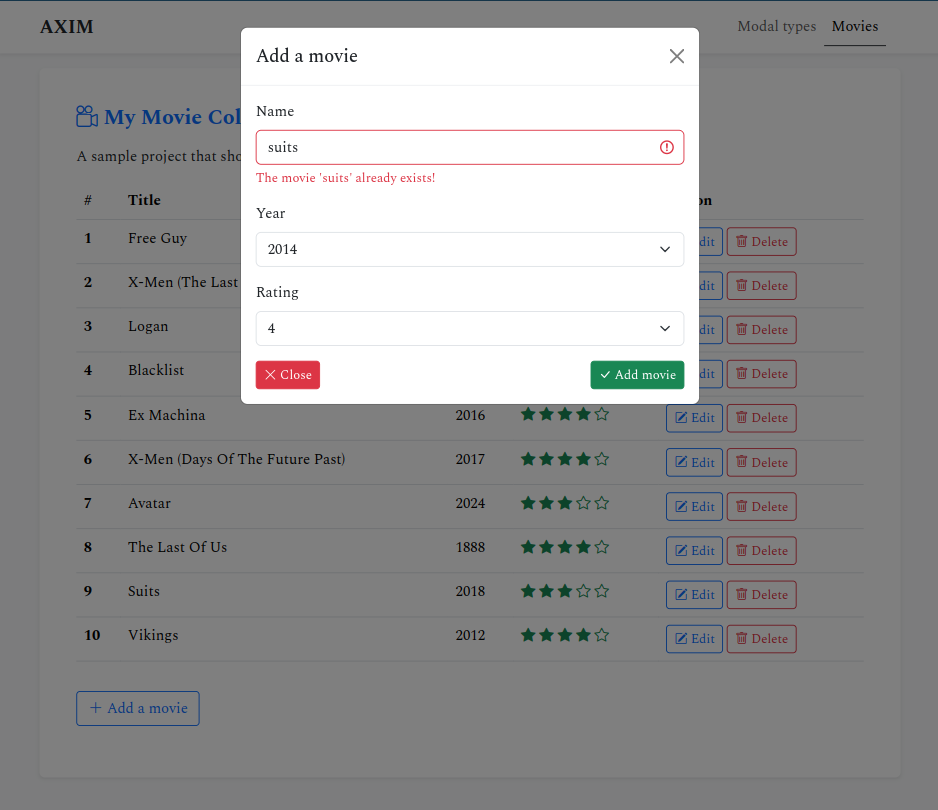
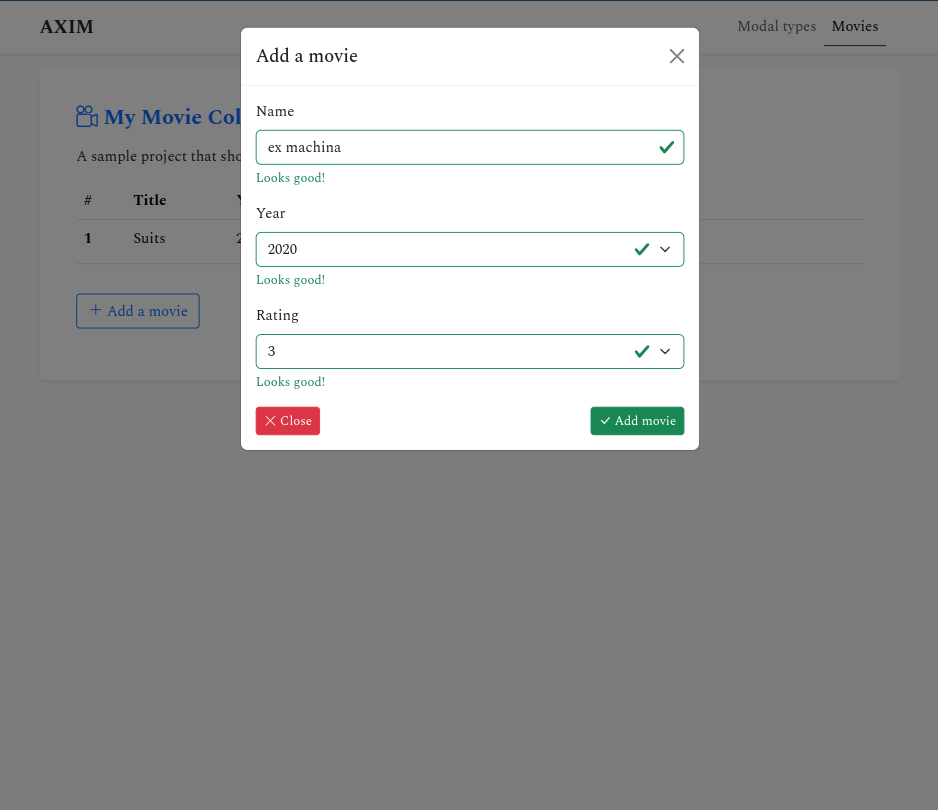

# Modals (ambiorix + htmx)

A sample project that shows how to support modal forms with ambiorix + htmx.

Persistent storage has been implemented using MongoDB.

# Exhibits

- We first explore the different types of modals.



- Then movie table.



- Add new movie.



- Input validation.







# Prerequisites

- An installation of the community edition of [MongoDB](https://www.mongodb.com/docs/manual/administration/install-community/)

# Installation

1. Clone this repo and `cd` into the `modals/` directory:
    ```r
    git clone git@github.com:kennedymwavu/ambiorix-htmx.git
    cd ambiorix-htmx/modals
    ```
1. Add an env file (`.Renviron`) at the root dir of the project with these variables:
    ```r
    MONGO_DB = ambiorix-htmx
    MODALS_COLLECTION = modals
    HOST = 127.0.0.1
    PORT = 8000
    RENV_CONFIG_SANDBOX_ENABLED = FALSE
    ```
    You can change the default values if you wish.
1. Fire up R and install the dependencies:
    ```r
    renv::restore()
    ```

# Start app

`index.R` is the entry point of the app. Run the following command to start the app.

```r
Rscript index.R
```
