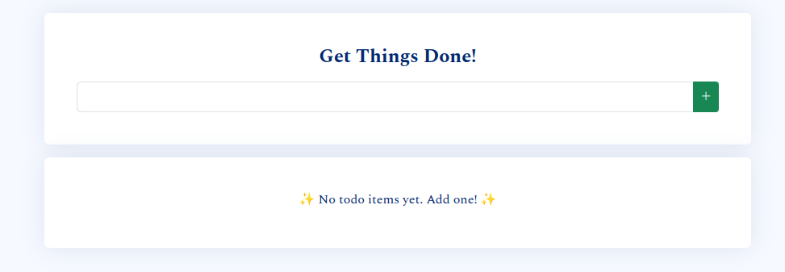
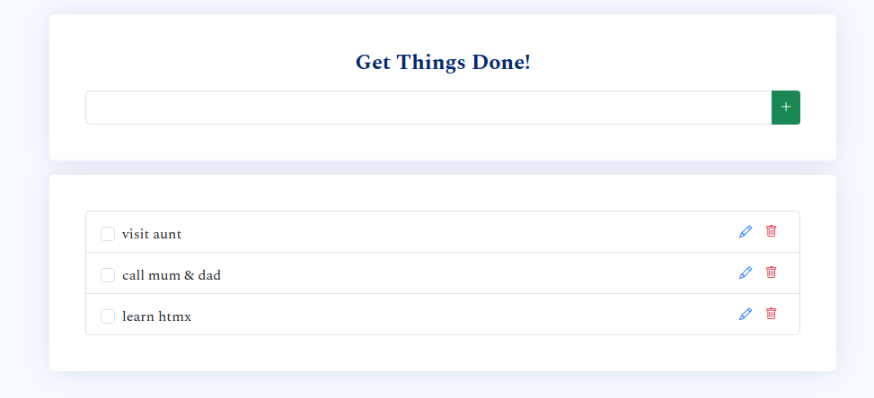
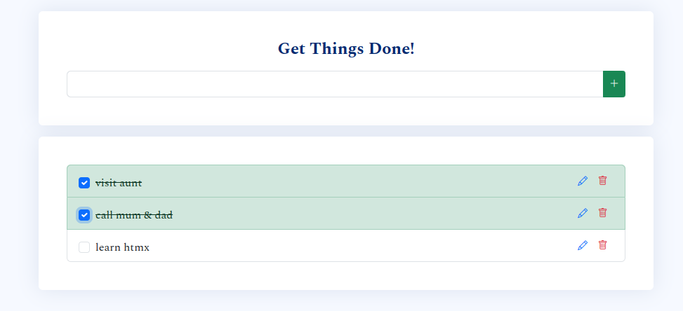

# Todo List

A simple todo list application using ambiorix + htmx.

A big upgrade from "Hello, World!", tbh.

# Exhibits

- Empty todo list



- Unchecked todo list



- Checked todo list



# Prerequisites

- An installation of the community edition of [MongoDB](https://www.mongodb.com/docs/manual/administration/install-community/)

# Installation

1. Clone this repo and `cd` into the `todolist/` directory.
    ```bash
    git clone git@github.com:kennedymwavu/ambiorix-htmx.git
    cd ambiorix-htmx/todolist/
    ```
1. Install the dependencies.
    ```bash
    Rscript install_deps.R
    ```
1. Add an env file (`.Renviron`) at the root dir of the project with the following content.
    ```bash
    MONGO_DB = ambiorix-htmx
    TODO_COLLECTION = todo
    HOST = 127.0.0.1
    PORT = 8000
    ```
    You can change the values of the variables to suit your environment.

# Start app

`index.R` is the entry point of the app. Run the following command to start the app.
```bash
Rscript index.R
```
